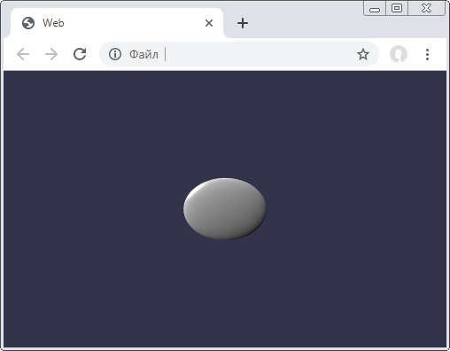

**babylonKt**

Babylon.js wrapper: https://github.com/imcasper/babylonKt

**example-simple**

First execute the gradle command. It will build an engine, it will also collect an example for demonstration:

    gradle build

Now you can start application:

    /example-simple/build/web/index.html
   
If everything works correctly, you will see something like this:

For actual use, you must declare `babylonKt` in the dependencies, and do not forget to add links to the original js files in the `html.index`. You may study `example-1` in detail to better understand this.